# Never Gonna Lens You Up
> Sebuah website sistem temu balik gambar (reverse image search) yang menggunakan Content Based Image Retrieval (CBIR) dengan parameter warna dan parameter tekstur.

## Daftar Isi
* [General Info](#general-information)
* [Technologies Used](#technologies-used)
* [Features](#features)
* [Screenshots](#screenshots)
* [Setup](#setup)
* [Usage](#usage)
* [Project Status](#project-status)
* [Room for Improvement](#room-for-improvement)
* [Acknowledgements](#acknowledgements)
* [Contact](#contact)
<!-- * [License](#license) -->

## Informasi Umum
- Website ini dibuat dengan Python (Flask, Numpy, PIL), HTML5, dan CSS.
- Website ini dibuat sebagai sistem temu balik gambar, yaitu mencari gambar dari dataset yang mempunyai kemiripan tertinggi dengan gambar query.
- Website ini dibuat untuk memenuhi Tugas Besar 2 Aljabar Linear dan Geometri 2023/2024.
- Tugas Besar ini diberikan untuk menguji pemahaman terhadap penerapan Aljabar Linear dan Geometri di Informatika, terutama Aljabar Vektor.
<!-- You don't have to answer all the questions - just the ones relevant to your project. -->

## Teknologi yang dipakai
- Python 3.10.6
- Flask 3.0.0
- Werkzeug 3.0.1
- PIL 
- HTML5
- CSS

## Fitur
List the ready features here:
- Input gambar query dan dataset
- Pilihan CBIR dengan parameter warna atau parameter tekstur
- Paginasi
- Responsive web design
- Dataset caching/pre-processing
- Export luaran dalam bentuk file pdf
- Page tutorial, about us, dan concept

## Screenshot
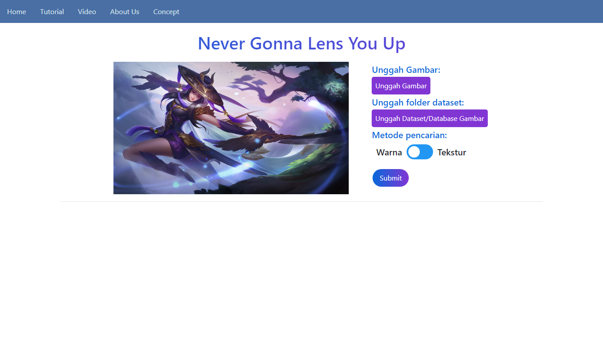
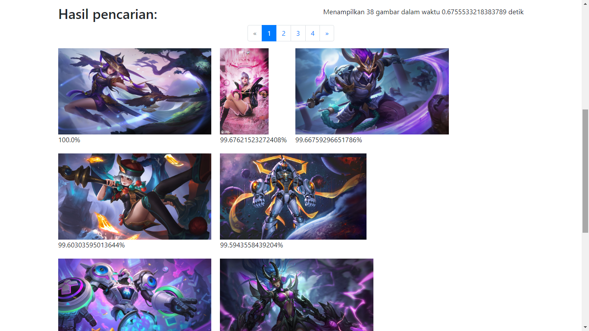
<!-- If you have screenshots you'd like to share, include them here. -->

## Cara Setup
1. Clone repository ini ke local repository.
2. Jika source code index.html, style.css, server.py, dan image.py masih berada di dalam folder src, keluarkan semuanya dari folder src dan pindahkan setiap file di atas dengan petunjuk berikut.

    a. index.html dipindahkan ke folder templates/.
   
    b. style.css dipindahkan ke folder static/css/ (folder css terletak di dalam folder static)
   
    c. server.py dan images.py dipindahkan ke parent dari folder src (atau di folder root dari local repository ini).
4. Buka terminal/powershell di folder root local repository ini dan ketik python server.py lalu tekan enter.
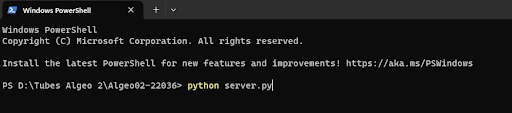
5. Terminal/powershell akan memberikan Anda sebuah link untuk menuju website. Ctrl + klik link tersebut untuk membuka website.
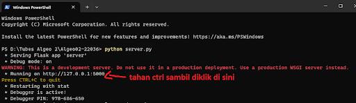

## Cara menggunakan website
1. Berikut adalah tampilan antarmuka website beserta fungsinya jika Anda baru pertama kali membuka website ini.
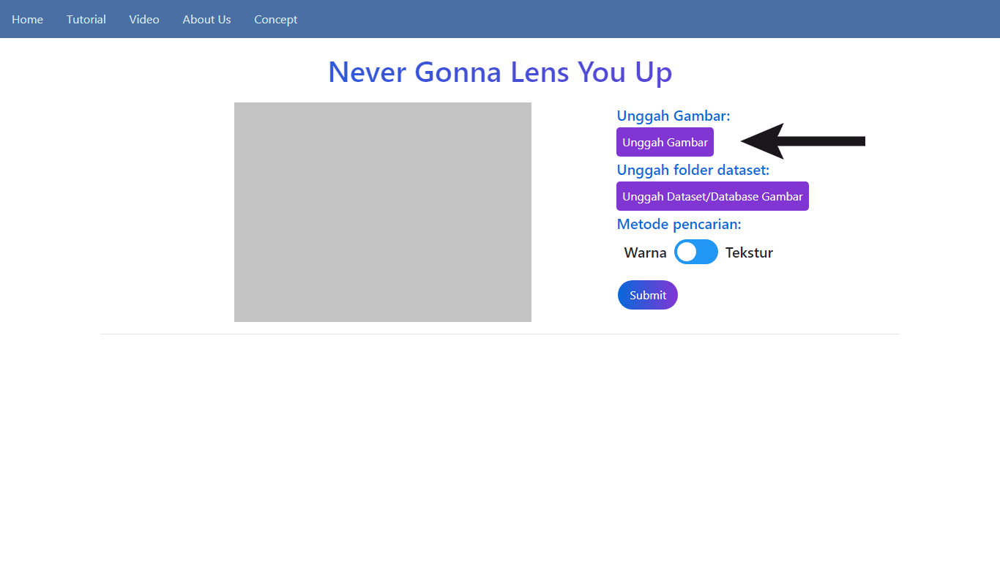
2. Unggah dataset dengan klik tombol Unggah Dataset/Database Gambar lalu pilih folder (bukan memilih kumpulan file). Pastikan folder dataset hanya berisi kumpulan file yang memiliki ekstensi berikut: .png, .jpg, .jpeg, .bmp. Setelah itu, tekan tombol Submit untuk mengunggah folder tersebut ke server.
3. Setelah anda berhasil mengunggah dataset gambar, tampilan website akan berubah menjadi di bawah ini.
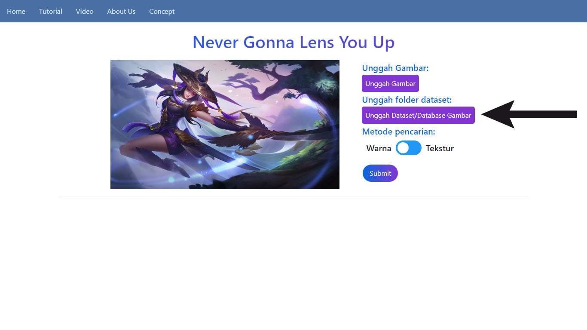
4. Unggah gambar query dengan tombol Unggah Gambar lalu pilih satu file gambar yang ingin dicari. Pastikan gambar query berformat salah satu dari ekstensi berikut: .png, .jpg, .jpeg, .bmp. 
5. Pilih salah satu metode pencarian gambar dengan tombol yang berada di atas tombol Submit. Pilih antara metode CBIR dengan parameter warna atau parameter tekstur.
6. Setelah memilih metode pencarian gambar, klik tombol Submit untuk memulai pencarian gambar.
7. Jika pencarian selesai, maka akan muncul gambar-gambar yang sudah terurut berdasarkan kemiripannya dengan gambar query. Anda bisa melihat halaman berikutnya Anda juga bisa mengunduh hasil pencarian gambar sebagai file pdf.

8. Anda bisa mengulang proses mengunggah dataset, gambar query, dan pencarian sesuka hati Anda.

## Status Proyek
Project is: _complete_.

## Ruang Perbaikan
- Perbesar batas untuk mengunggah dataset.
- Perbagus tampilan website.
- Tambahkan opsi input gambar query dari kamera.
- Web scraping untuk menambah gambar dalam dataset.
- Object detector untuk optimalisasi sistem temu balik gambar.

## Pengetahuan
- Proyek ini terinspirasi dari beberapa tutorial, beberapa di antaranya sebagai berikut.

    [Content Based Image Retrieval Using Gray Scale Weighted Average Method](https://www.researchgate.net/figure/Image-retrieval-using-color-average-weighted-method_fig7_307707028)

    [[CVPR20 Tutorial] Live-coding Demo to Implement an Image Search Engine from Scratch](https://www.youtube.com/watch?v=M0Y9_vBmYXU&t=261s&pp=ygUbcmV2ZXJzZSBpbWFnZSBzZWFyY2ggcHl0aG9u)

    [Feature Extraction : Gray Level Co-occurrence Matrix (GLCM)](https://yunusmuhammad007.medium.com/feature-extraction-gray-level-co-occurrence-matrix-glcm-10c45b6d46a1)
  
    [WebCBIR](https://github.com/ledleledle/WebCBIR)
- Terimakasih yang sebesar-besarnya kepada semua anggota kelompok atas kerja samanya, juga kepada para asisten, teman-teman, dan pihak-pihak lainnya yang sudah membantu dalam pengerjaan Tugas Besar ini dan tidak dapat kami sebutkan satu per satu.

## Pengujian Website
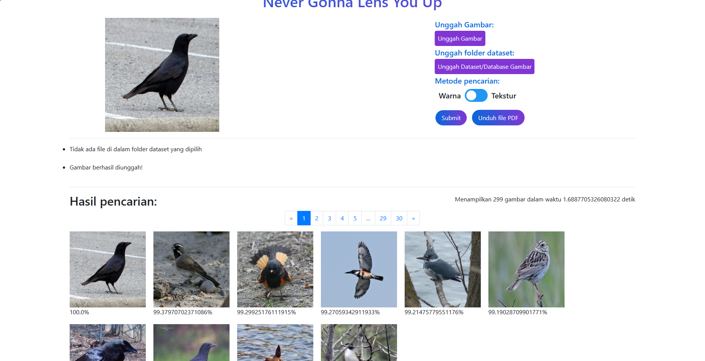

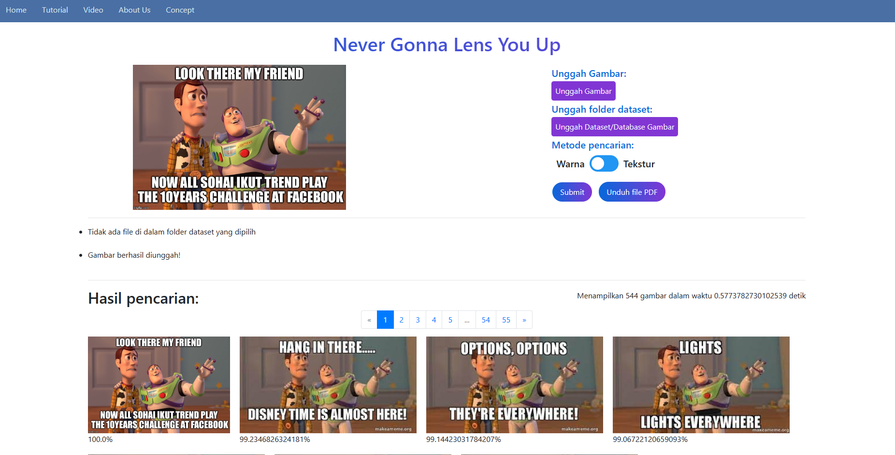
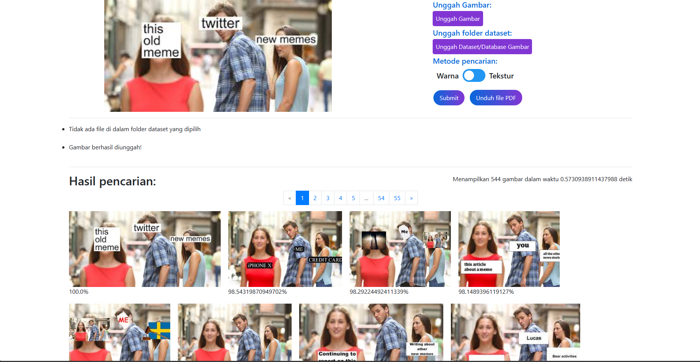
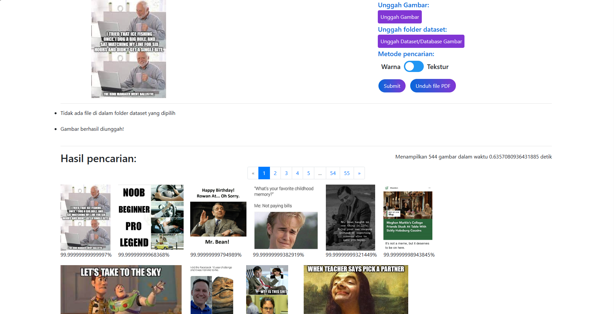
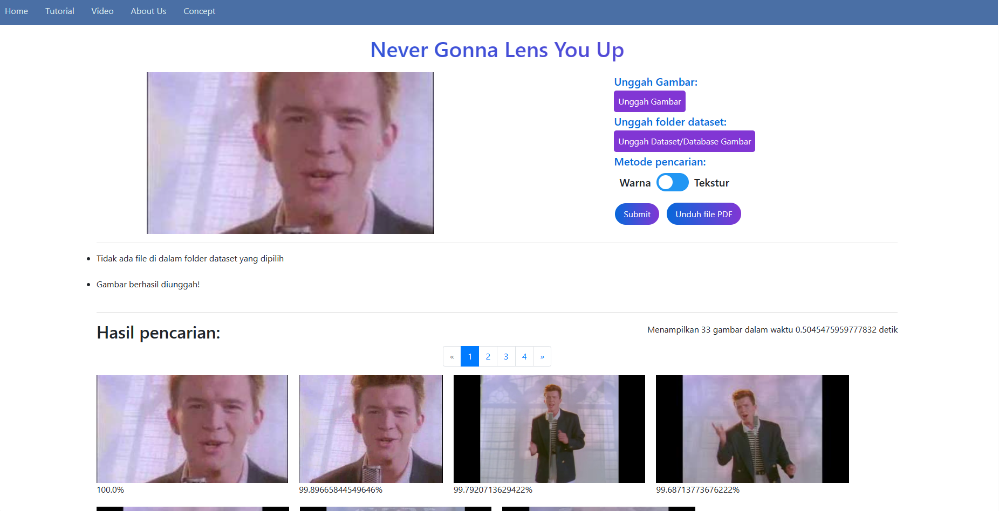
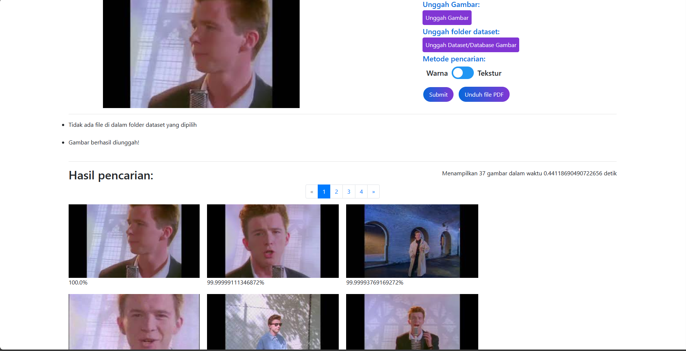
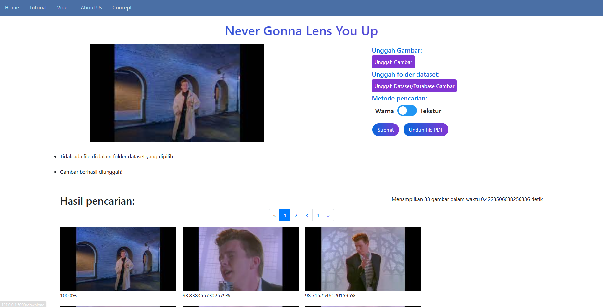
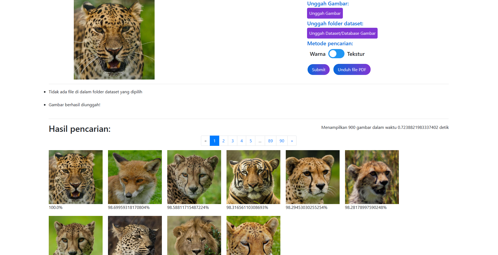
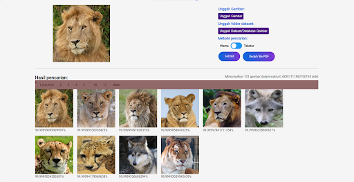
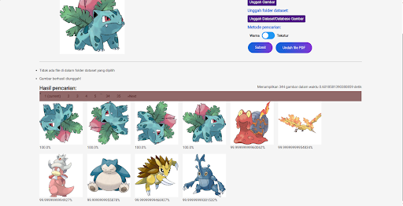

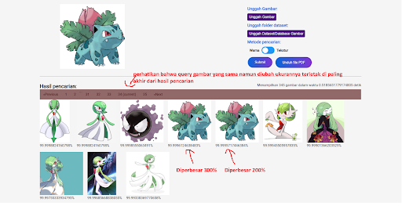
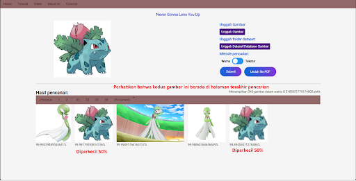
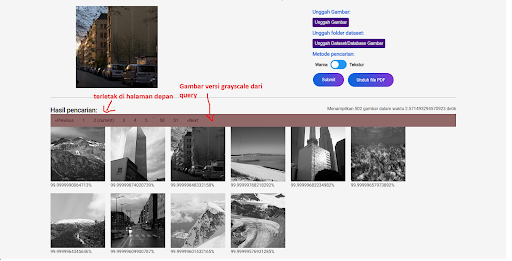
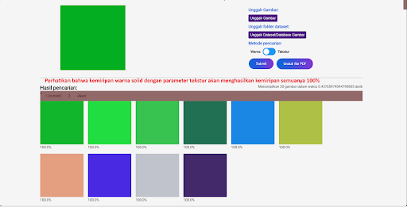
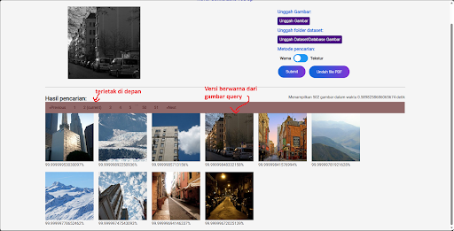
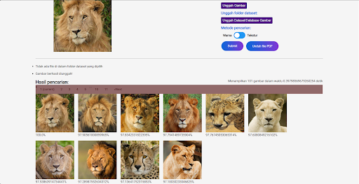
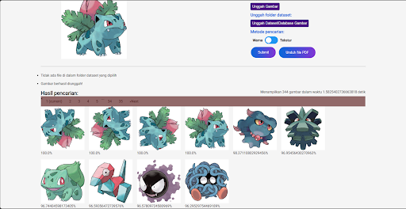
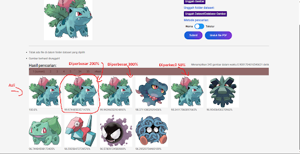
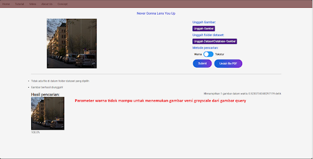
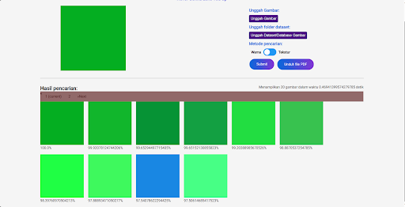
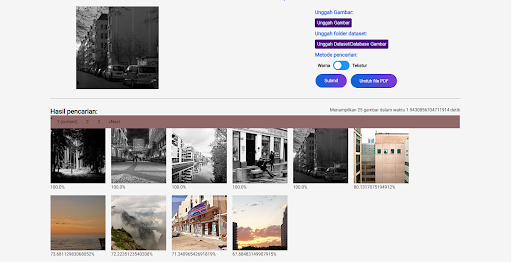
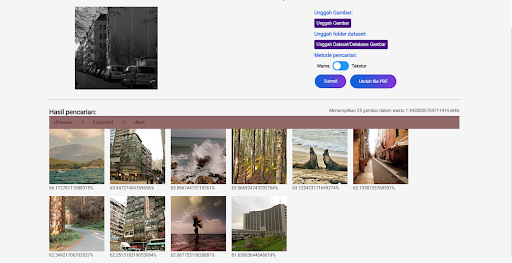
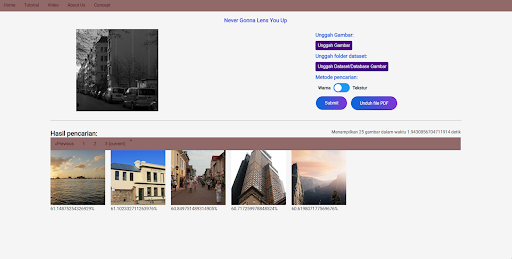
## Kontak
Dibuat oleh:
1. [Akbar Al Fattah](https://github.com/DeltDev) - 13522036
2. [Dzaky Satrio Nugroho](https://github.com/Kizaaaa) - 13522059
3. [Christopher Brian](https://github.com/ChristopherBrian) - 13522106

Feel free to contact us!

<!-- Optional -->
<!-- ## License -->
<!-- This project is open source and available under the [... License](). -->

<!-- You don't have to include all sections - just the one's relevant to your project -->
